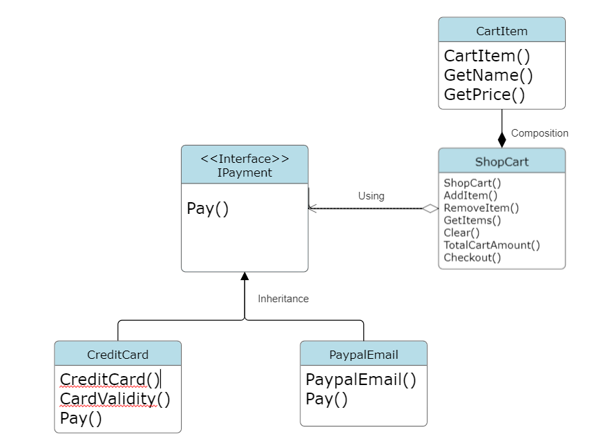

 # Overview

Strategy Design Pattern is implemented here in this project. A strategy design pattern is a behavioral design pattern that allows you to define a family of interchangeable algorithms or behaviors and make them available for selection at runtime. This pattern is particularly useful when you want to encapsulate different algorithms and allow clients to choose between them without changing the client's code. The strategy pattern promotes flexibility and extensibility in your code by separating the algorithm from the client.

Real world applications of the Strategy pattern include the following: Sorting Algorithms, Compression Software, Payment Processing, Graphics Rendering, Network Routing. The Strategy pattern is used in
- Sorting Algorithms to switch between different sorting algorithms (e.g., quicksort, mergesort, bubblesort) depending on the size and type of data being sorted,Compression in software that deals with data, such as databases or spreadsheet applications.
- Compression Software to allow users to choose different compression algorithms (e.g., ZIP, GZIP, RAR) based on their preferences and requirements.
- Payment Processing for users to select their preferred payment method at checkout.
- Graphics Rendering to switch between different rendering techniques or engines.
- Network Routing to employ different routing algorithms (e.g., OSPF, BGP, RIP) as strategies to determine the best paths for data packets.

# Design
This project implements a Payment Gateway for a Shopping Cart. Two payment strategies have been implemented (credit card and Paypal). The clients can choose which payment method to use at runtime.

# Environment

The project builds and runs with Visual Studio Community 2022 when the required workloads are installed.
